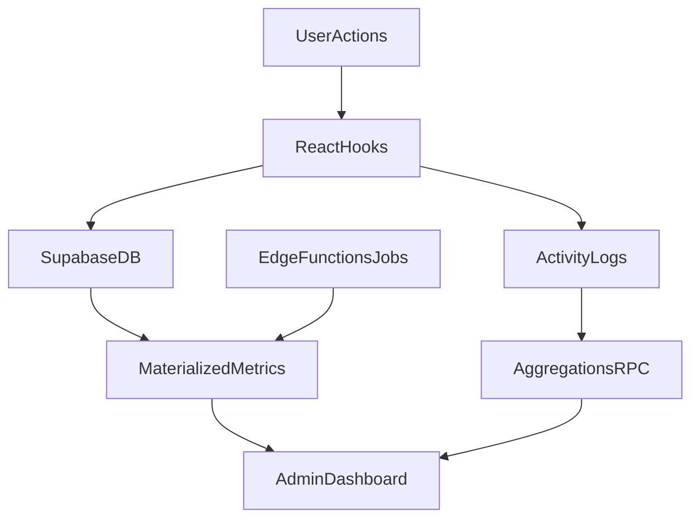

# Plano de Implementação — 4 pilares em 100%

## Escopo fechado

- Incluído: Processos Seletivos, Eventos, Gestão de Membros e Analytics/Admin.
- Excluído: chatbot e ranking de entidades (e qualquer expansão fora dos 4 pilares).

## Diagnóstico consolidado (o que falta hoje)

- **Analytics/Admin:** tracking e activity logging ainda simulados (sem persistência real) em [src/hooks/useActivityLogger.ts](c:/Users/mateu/Documents/hub-entidades/src/hooks/useActivityLogger.ts) e [src/components/PageTrackingProvider.tsx](c:/Users/mateu/Documents/hub-entidades/src/components/PageTrackingProvider.tsx).
- **Eventos:** vínculo evento-reserva sem transação/validações fortes em [src/hooks/useVincularEventoReserva.ts](c:/Users/mateu/Documents/hub-entidades/src/hooks/useVincularEventoReserva.ts); inscrição sujeita a race condition em [src/hooks/useInscricaoEvento.ts](c:/Users/mateu/Documents/hub-entidades/src/hooks/useInscricaoEvento.ts); regra de visibilidade depende de join frágil em [src/hooks/useEventos.ts](c:/Users/mateu/Documents/hub-entidades/src/hooks/useEventos.ts).
- **Processos seletivos:** fluxo funcional, mas com pontos frágeis de consistência (múltiplos `.single()`, lógica repetida de aprovação/fase final) em [src/hooks/useAcompanhamentoFases.ts](c:/Users/mateu/Documents/hub-entidades/src/hooks/useAcompanhamentoFases.ts).
- **Gestão de membros:** remoção/desativação sem cascata explícita para vínculos de projeto e sem unificação de regra de reativação em [src/hooks/useMembrosEntidade.ts](c:/Users/mateu/Documents/hub-entidades/src/hooks/useMembrosEntidade.ts), [src/components/VincularMembrosProjeto.tsx](c:/Users/mateu/Documents/hub-entidades/src/components/VincularMembrosProjeto.tsx), [src/hooks/useInscricaoFasePS.ts](c:/Users/mateu/Documents/hub-entidades/src/hooks/useInscricaoFasePS.ts), [src/hooks/useInscricoesProcesso.ts](c:/Users/mateu/Documents/hub-entidades/src/hooks/useInscricoesProcesso.ts).
- **Qualidade transversal:** excesso de `console.log`, rotas de debug em [src/App.tsx](c:/Users/mateu/Documents/hub-entidades/src/App.tsx), tipagem Supabase incompleta em [src/integrations/supabase/types.ts](c:/Users/mateu/Documents/hub-entidades/src/integrations/supabase/types.ts), ausência de migrações SQL versionadas em [supabase/migrations](c:/Users/mateu/Documents/hub-entidades/supabase/migrations).

## Arquitetura-alvo (dados confiáveis)

## Fase 1 — Fundação de dados e segurança (P0)

- Criar migrações SQL versionadas em [supabase/migrations](c:/Users/mateu/Documents/hub-entidades/supabase/migrations) para:
  - `activity_logs` (e/ou `page_visits` se mantiver separado), índices e RLS.
  - funções RPC faltantes usadas por [src/hooks/useDashboardData.ts](c:/Users/mateu/Documents/hub-entidades/src/hooks/useDashboardData.ts): `get_dashboard_stats`, `get_comprehensive_dashboard_stats`, `get_entity_visit_stats`, `generate_dashboard_report`.
  - constraints de integridade para eventos/reservas e membros (unicidade e consistência).
- Revisar RLS dos 4 pilares para garantir: leitura/escrita mínima necessária, sem brechas para perfis não autorizados.
- Definir contratos de schema e atualizar tipos em [src/integrations/supabase/types.ts](c:/Users/mateu/Documents/hub-entidades/src/integrations/supabase/types.ts).

## Fase 2 — Hardening de Eventos (P0/P1)

- Fortalecer regra de visibilidade pública em [src/hooks/useEventos.ts](c:/Users/mateu/Documents/hub-entidades/src/hooks/useEventos.ts): tratamento robusto do join de reservas + fallback seguro.
- Reescrever fluxo de vínculo em [src/hooks/useVincularEventoReserva.ts](c:/Users/mateu/Documents/hub-entidades/src/hooks/useVincularEventoReserva.ts) para operação atômica (RPC/transação), com validações:
  - evento e reserva válidos,
  - status compatíveis,
  - prevenção de vínculo duplicado cruzado.
- Endurecer inscrições em [src/hooks/useInscricaoEvento.ts](c:/Users/mateu/Documents/hub-entidades/src/hooks/useInscricaoEvento.ts): evitar race condition de vagas e barrar inscrição em evento inelegível.
- Uniformizar regra de publicação em hooks de leitura relacionados a eventos (incluindo visões de entidade/admin quando aplicável).

## Fase 3 — Hardening de Processos Seletivos (P0/P1)

- Consolidar regra de aprovação/avanço de fase em um fluxo único em [src/hooks/useAcompanhamentoFases.ts](c:/Users/mateu/Documents/hub-entidades/src/hooks/useAcompanhamentoFases.ts), reduzindo branches frágeis.
- Trocar pontos sensíveis de `.single()` para abordagem segura quando ausência de dado é aceitável (`.maybeSingle()` + tratamento explícito).
- Fechar lacunas de UX de acompanhamento de fase em [src/components/AcompanhamentoFasesPS.tsx](c:/Users/mateu/Documents/hub-entidades/src/components/AcompanhamentoFasesPS.tsx).
- Garantir idempotência de operações de aprovação/movimentação para evitar duplicação em cliques repetidos.

## Fase 4 — Gestão de Membros em consistência forte (P0/P1)

- Centralizar regra de “criar ou reativar membro” em uma única camada compartilhada usada por:
  - [src/hooks/useMembrosEntidade.ts](c:/Users/mateu/Documents/hub-entidades/src/hooks/useMembrosEntidade.ts)
  - [src/hooks/useInscricaoFasePS.ts](c:/Users/mateu/Documents/hub-entidades/src/hooks/useInscricaoFasePS.ts)
  - [src/hooks/useInscricoesProcesso.ts](c:/Users/mateu/Documents/hub-entidades/src/hooks/useInscricoesProcesso.ts)
  - [src/hooks/useAcompanhamentoFases.ts](c:/Users/mateu/Documents/hub-entidades/src/hooks/useAcompanhamentoFases.ts)
- Corrigir remoção/desativação para manter consistência com `projeto_membros` e contagens de entidade.
- Validar permissões de gestão antes de ações críticas de vínculo/remoção/cargo.
- Eliminar dependência de nomes hardcoded de cargo para fluxos automáticos de aprovação final.

## Fase 5 — Analytics/Admin 100% confiável (P0/P1)

- Implementar persistência real de tracking em:
  - [src/hooks/useActivityLogger.ts](c:/Users/mateu/Documents/hub-entidades/src/hooks/useActivityLogger.ts)
  - [src/components/PageTrackingProvider.tsx](c:/Users/mateu/Documents/hub-entidades/src/components/PageTrackingProvider.tsx)
  - [src/hooks/usePageTracking.ts](c:/Users/mateu/Documents/hub-entidades/src/hooks/usePageTracking.ts)
- Remover fallbacks frágeis em [src/hooks/useDashboardData.ts](c:/Users/mateu/Documents/hub-entidades/src/hooks/useDashboardData.ts), usando RPCs oficiais + estratégia de cache/invalidação por evento.
- Configurar execução periódica e monitorável das Edge Functions de indicadores em [supabase/functions](c:/Users/mateu/Documents/hub-entidades/supabase/functions).
- Estabelecer checks de qualidade de dados (consistência entre tabelas agregadas e origem).

## Fase 6 — Qualidade de produção e governança (P1)

- Reduzir drasticamente `console.log` em produção (manter `console.error` útil e logging estruturado).
- Remover exposição de rotas de debug em [src/App.tsx](c:/Users/mateu/Documents/hub-entidades/src/App.tsx).
- Refatorar pontos com `any` para `unknown` + narrowing e `import type` quando aplicável.
- Validar build, lint e smoke tests antes de cada merge.

## Estratégia de testes (obrigatória para “excelência completa”)

- **Unitários (hooks críticos):** eventos (visibilidade/vagas/vínculo), PS (aprovação/avanço/última fase), membros (reativação/remover/cargo), analytics (normalização de dados).
- **Integração (Supabase):** fluxos atômicos com RLS + constraints reais (não mockado apenas).
- **E2E (fluxos de negócio):**
  - PS completo: inscrição -> fases -> aprovação final -> membro ativo.
  - Evento completo: criação -> aprovação -> publicação -> inscrição com limite.
  - Admin analytics: ingestão de tracking -> dashboard consistente -> exportação.
- **Regressão:** cenários de concorrência (duplo clique, requisição repetida, corrida por vagas).

## Critérios de aceite por pilar

- **Processos seletivos:** zero TODO funcional, avanço de fases idempotente, aprovação final sempre reflete em membresia correta.
- **Eventos:** regra de publicação 100% aderente, sem inconsistência evento-reserva, inscrições sem estourar vagas por concorrência.
- **Gestão de membros:** sem duplicidades ativas, reativação determinística, permissões aplicadas e cascata consistente com projetos.
- **Analytics admin:** tracking persistente, métricas auditáveis, atualização periódica automatizada, dashboard responsivo e confiável.

## Sequenciamento sugerido (execução)

1. Fase 1 (dados/RLS/tipos)
2. Fase 2 (eventos)
3. Fase 3 (PS)
4. Fase 4 (membros)
5. Fase 5 (analytics/admin)
6. Fase 6 (hardening final + quality gate)

## Entregáveis finais

- Migrações SQL versionadas + políticas RLS auditadas.
- Hooks/componentes dos 4 pilares estabilizados.
- Suite de testes unit/integration/e2e para fluxos críticos.
- Checklist de Go-Live com evidência de carga, segurança e consistência de dados.

