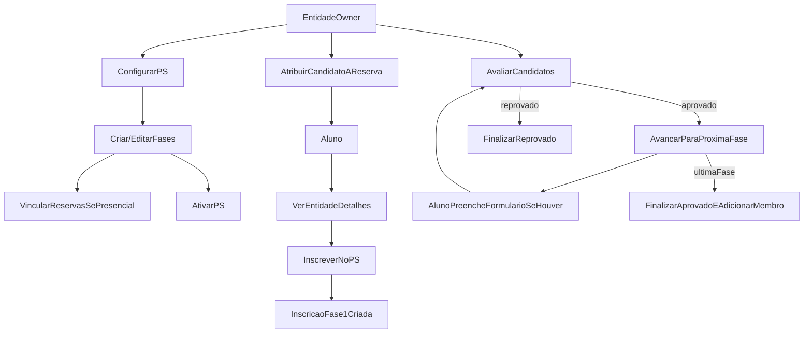

# Plano de verificação — Processo Seletivo completo

## Objetivo

Garantir que o fluxo de **criação, configuração, inscrições e acompanhamento** do Processo Seletivo esteja **correto, consistente e sem pontos mortos** tanto para **Entidade (owner)** quanto para **Aluno**, com regras claras de permissão (RLS), estados e UX.

## Decisões já fixadas (conforme você respondeu)

- **Cancelamento pelo aluno**: permitido **somente enquanto a inscrição geral estiver `pendente`**.
- **Formulários por fase**: **híbrido** (fase pode usar `template_formulario_id` *ou* um formulário próprio em `formularios_fases_ps`).

## Mapa rápido do que existe hoje (pontos a validar)

- **Entidade (owner)**: configuração e gestão em `[src/pages/EntidadeDetalhes.tsx](src/pages/EntidadeDetalhes.tsx)` com tabs **Configuração / Fases / Inscrições / Acompanhamento**.
- **Criação/gestão de fases**: `[src/hooks/useFasesProcesso.ts](src/hooks/useFasesProcesso.ts)`, UI em `[src/components/GerenciarFasesProcesso.tsx](src/components/GerenciarFasesProcesso.tsx)`.
- **Inscrição do aluno**: UI em `[src/components/BotaoInscreverEntidade.tsx](src/components/BotaoInscreverEntidade.tsx)` usando `[src/hooks/useAplicacaoProcesso.ts](src/hooks/useAplicacaoProcesso.ts)`.
- **Gestão/decisão (owner)**: `[src/hooks/useInscricoesProcesso.ts](src/hooks/useInscricoesProcesso.ts)` e `[src/components/ListaInscricoesEntidade.tsx](src/components/ListaInscricoesEntidade.tsx)`.
- **Acompanhamento por fase (owner)**: `[src/hooks/useAcompanhamentoFases.ts](src/hooks/useAcompanhamentoFases.ts)` e `[src/components/AcompanhamentoFasesPS.tsx](src/components/AcompanhamentoFasesPS.tsx)`.
- **Reservas por fase/candidato**: `[src/hooks/useFaseReservas.ts](src/hooks/useFaseReservas.ts)`, `[src/components/VincularReservasFase.tsx](src/components/VincularReservasFase.tsx)`, `[src/hooks/useCandidatosReservas.ts](src/hooks/useCandidatosReservas.ts)`, `[src/components/AtribuirCandidatosReserva.tsx](src/components/AtribuirCandidatosReserva.tsx)`.
- **Visão do aluno (meus PS)**: `[src/pages/Perfil.tsx](src/pages/Perfil.tsx)` e hook `[src/hooks/useInscricoesProcessoUsuario.ts](src/hooks/useInscricoesProcessoUsuario.ts)`.
- **Formulário de fase (aluno)**: `[src/components/FormularioFaseProcesso.tsx](src/components/FormularioFaseProcesso.tsx)` + hook `[src/hooks/useFormularioFase.ts](src/hooks/useFormularioFase.ts)`.

## Fluxo alvo (visão macro)

## Preparação de verificação (ambiente e dados)

- **Contas**:
  - **Aluno A** (perfil completo).
  - **Aluno B** (perfil completo).
  - **Entidade Owner** (mesma entidade usada nos testes).
- **Entidade de teste**:
  - `areas_estrutura_organizacional` preenchida.
  - `areas_processo_seletivo` configurável.
  - (Se testar presencial) **reservas** aprovadas existentes.
- **Checklist de banco (Supabase)**: confirmar existência/colunas/RLS nas tabelas:
  - `entidades` (campos de PS: `processo_seletivo_ativo`, `abertura_processo_seletivo`, `fechamento_processo_seletivo`, `numero_total_fases`, `areas_processo_seletivo`…)
  - `processos_seletivos_fases`
  - `inscricoes_processo_seletivo` (unique `(entidade_id, user_id)`)
  - `inscricoes_fases_ps` (inclui `formulario_preenchido`, `respostas_formulario`, `status`, `feedback`)
  - `templates_formularios`
  - `formularios_fases_ps` (se ficar no híbrido)
  - `fases_reservas`, `candidatos_reservas`
  - `membros_entidade` (para auto-conversão ao final)
  - ver também `docs/auditoria-ps-schema-rls.md` e `docs/auditoria-ps-estado-grants-rls.md` para detalhes de schema/constraints/GRANTs/RLS levantados na auditoria.

## Plano de verificação — Entidade (owner)

### 1) Acesso e navegação

- **A entidade consegue acessar a área de PS mesmo com `processo_seletivo_ativo=false`** (para configurar antes de abrir inscrições).
- **Tabs** carregam sem erro: Configuração / Fases / Inscrições / Acompanhamento.

### 2) Configuração do PS

- **Ativar/desativar** PS altera apenas elegibilidade de inscrição do aluno (não “esconde” configuração do owner).
- **Período (abertura/fechamento)**:
  - Validação visual: abertura <= fechamento.
  - Reflexo na UX do aluno (inscrição permitida apenas dentro do período).
- **Número total de fases**:
  - Persistência correta.
  - Usado para determinar “última fase” (critério do backend/cliente).

### 3) Fases (criação/edição)

- Criar fase com:
  - `ordem` sem colisão.
  - `ativa` on/off.
  - `data_inicio/data_fim` dentro do período do PS.
  - validação de sequência (fase N não começa antes do fim da N-1).
- Editar:
  - mudar ordem (sem conflito), datas, template, presencial.
- Deletar:
  - regras atuais (ex: não deletar fase 1 se PS ativo) funcionando e com feedback claro.

### 4) Formulários por fase (híbrido)

Definir e validar precedência (critério de aceitação):

- Se `processos_seletivos_fases.template_formulario_id` existir → **usar template**.
- Senão, se existir `formularios_fases_ps` ativo → **usar formulário próprio**.
- Senão → fase sem formulário.

Verificar:

- O que o aluno vê ao se inscrever e ao avançar de fase.
- Campos obrigatórios realmente bloqueiam envio.

### 5) Reservas (fase presencial)

- Marcar fase como `presencial=true`.
- Vincular reservas aprovadas à fase e validar:
  - não vincula reserva não aprovada.
  - conflito/capacidade (se aplicável) bloqueia e informa.
- Atribuir candidatos a uma reserva vinculada.
- Confirmar que a reserva atribuída aparece no acompanhamento do owner.

### 6) Inscrições e decisão

- Listagem:
  - aparece apenas candidatos da entidade.
  - filtro por fase funciona.
- Aprovar/Reprovar:
  - aprovar move candidato para próxima fase (se existir).
  - aprovar na última fase → atualiza inscrição geral para `aprovado` e cria `membros_entidade`.
  - reprovar → inscrição geral vira `reprovado`.
- Idempotência:
  - clicar duas vezes em aprovar não duplica inscrição de fase.

## Plano de verificação — Aluno

### 1) Elegibilidade de inscrição

- Quando PS **inativo**: aluno não consegue se inscrever (UI desabilitada + mensagem).
- Quando **fora do período**: aluno não consegue se inscrever (UI desabilitada + mensagem).
- Quando ativo e dentro do período: consegue abrir diálogo e enviar inscrição.

### 2) Inscrição inicial

- Prefill de dados do perfil (nome/email/curso/semestre) correto.
- Área de interesse:
  - se `areas_processo_seletivo` existir, aluno escolhe de lista.
  - se vazio, fallback aceita texto livre (e comunica bem).
- Após enviar:
  - cria `inscricoes_processo_seletivo`.
  - cria automaticamente `inscricoes_fases_ps` para a **fase 1**.
  - se fase 1 tem formulário (template ou próprio), `formulario_preenchido` deve iniciar como **false**.

### 3) Acompanhamento no perfil

- Em `[src/pages/Perfil.tsx](src/pages/Perfil.tsx)` o aluno vê:
  - entidade, status geral (`pendente/aprovado/reprovado`), fase atual e status da fase.
  - histórico/timeline (se previsto) coerente.
- Caso a fase atual exija formulário e esteja pendente:
  - aluno encontra um CTA claro para preencher.
  - ao enviar, `formulario_preenchido=true` e a UI atualiza.

### 4) Cancelamento (regra escolhida)

- Botão de cancelar aparece **somente se `inscricoes_processo_seletivo.status === 'pendente'`**.
- Ao cancelar:
  - remove inscrição geral e dependências (`inscricoes_fases_ps`, `candidatos_reservas` associados, etc.).
  - após cancelar, aluno consegue se inscrever novamente (respeitando unique).

## Casos de borda e regressões obrigatórias

- **Entidade altera `numero_total_fases` com candidatos em andamento**.
- **Desativar uma fase** com candidatos nela.
- **Deletar fase** com vínculos de reserva ou inscrições existentes.
- **Múltiplos candidatos** e **múltiplos owners** operando ao mesmo tempo.
- **RLS**: aluno não consegue ler/escrever inscrições de outros; entidade não enxerga candidatos de outras entidades.

## Automação recomendada (para manter “perfeito”)

### Playwright (E2E)

Criar um roteiro mínimo:

- Aluno se inscreve em PS.
- Owner aprova fase 1 → aluno vê fase atual mudar.
- (Se fase exige formulário) aluno preenche → owner aprova.
- Última fase aprova → aluno vira membro.

Arquivos base existentes:

- `[playwright.config.ts](playwright.config.ts)`
- `[e2e/smoke.spec.ts](e2e/smoke.spec.ts)`

### Vitest (unit/integration leve)

Criar funções puras para regras e testar:

- elegibilidade (ativo + período),
- precedência de formulário (template vs próprio),
- regra de cancelamento.

## Observações de risco (itens que a verificação deve confirmar)

- **Owner configurando PS**: hoje a área de PS está condicionada a `processo_seletivo_ativo` em `[src/pages/EntidadeDetalhes.tsx](src/pages/EntidadeDetalhes.tsx)`, o que pode impedir configurar antes de ativar.
- **Template no botão de inscrição**: em `[src/components/BotaoInscreverEntidade.tsx](src/components/BotaoInscreverEntidade.tsx)` existe risco de uso incorreto de `getTemplateById` (assíncrono) e, portanto, campos personalizados não renderizarem.
- `**formulario_preenchido`**: em `[src/hooks/useAplicacaoProcesso.ts](src/hooks/useAplicacaoProcesso.ts)` o valor inicial precisa ser compatível com a regra “formulário pendente”.
- **Aluno no Perfil**: a seção de estatísticas usa `demonstracoes_interesse` (não PS) e pode ficar inconsistente com `inscricoes_processo_seletivo` em `[src/pages/Perfil.tsx](src/pages/Perfil.tsx)`.

## Entregáveis do ciclo de verificação

- Checklist preenchido (pass/fail) por cenário.
- Lista de bugs priorizada por severidade (bloqueador/alto/médio/baixo).
- Plano de correção incremental (primeiro desbloqueia fluxo; depois melhora UX; depois automação/regressão).
- Documentação do roteiro manual do owner em `docs/roteiro-manual-owner-processo-seletivo.md`.
- Documentação do roteiro manual do aluno em `docs/roteiro-manual-aluno-processo-seletivo.md`.

