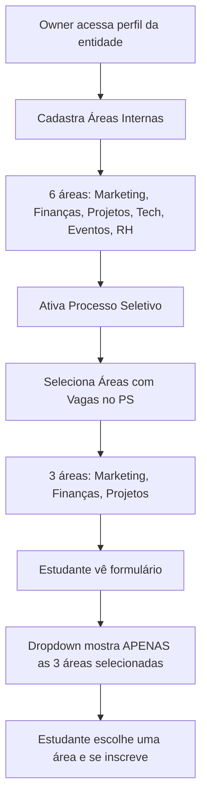

# 📋 Resumo: Separação de Áreas Internas e Áreas do Processo Seletivo

## 🎯 O Que Foi Solicitado

Separar as "áreas internas" em dois conceitos distintos:

1. **Áreas Internas (Estrutura Organizacional)**: Todos os departamentos/times da entidade
2. **Áreas do Processo Seletivo**: Subset das áreas internas com vagas abertas no PS

## ✅ O Que Foi Implementado

### 1. Alterações no Banco de Dados

**Migration 1:** `20250128_add_areas_internas.sql`
- Adiciona campo `areas_internas` (array de texto)

**Migration 2:** `20250129_separate_ps_areas.sql`
- Renomeia `areas_internas` → `areas_estrutura_organizacional`
- Cria novo campo `areas_processo_seletivo`
- Copia dados existentes para `areas_processo_seletivo`

**Estrutura Final:**
```sql
entidades.areas_estrutura_organizacional  -- Estrutura completa da organização
entidades.areas_processo_seletivo         -- Áreas com vagas abertas (subset)
```

### 2. Novos Componentes Criados

#### `GerenciarAreasProcessoSeletivo.tsx`
- Interface para selecionar áreas com vagas no PS
- Mostra checkboxes de todas as áreas internas
- Salva apenas as áreas marcadas em `areas_processo_seletivo`
- Localização: Tab "Configuração" do Processo Seletivo

#### `EditarProcessoSeletivo.tsx`
- Modal dedicado para editar configurações do PS
- Separado do modal de editar entidade
- Campos: toggle ativo, datas de abertura/fechamento/fases

### 3. Componentes Modificados

#### `GerenciarAreasInternas.tsx`
- Agora gerencia `areas_estrutura_organizacional`
- Adicionado prop `variant` para controlar estilos
  - `variant="header"`: Fundo escuro (branco semi-transparente)
  - `variant="default"`: Fundo claro (visível)
- Botão sempre visível (não mais oculto)

#### `BotaoInscreverEntidade.tsx`
- Campo "Área de Interesse" usa `areasPS` (não `areasInternas`)
- Mostra apenas áreas com vagas abertas
- Dropdown vazio mostra "Nenhuma área disponível no processo seletivo"

#### `useAreasInternas.ts`
- Retorna dois arrays:
  - `areasInternas`: `areas_estrutura_organizacional`
  - `areasPS`: `areas_processo_seletivo`
- Ambos são buscados em uma única query

#### `EntidadeDetalhes.tsx`
- Importa novos componentes
- Substitui modal de editar PS pelo componente dedicado
- Atualiza seção de áreas na tab "Configuração"
- Passa props corretos para `GerenciarAreasInternas`

## 📊 Fluxo de Uso



## 🔄 Diferenças Entre os Sistemas

### Antes (Sistema Antigo)
- Campo único: `areas_internas`
- Todas as áreas eram mostradas no formulário
- Não havia distinção entre estrutura organizacional e vagas abertas

### Agora (Sistema Novo)
- Dois campos: `areas_estrutura_organizacional` e `areas_processo_seletivo`
- Apenas áreas com vagas são mostradas no formulário
- Clara separação entre estrutura da organização e vagas do PS

## 📁 Arquivos de Documentação

| Arquivo | Propósito |
|---------|-----------|
| `INSTRUCOES-APLICAR-MIGRATION-AREAS.md` | **Passo a passo** para aplicar migrations no Supabase |
| `TESTE-SEPARACAO-AREAS.md` | **Guia de testes** completo com cenários |
| `verify-areas-migration.sql` | **Script SQL** para verificar se migrations foram aplicadas corretamente |
| `SEPARACAO-AREAS-IMPLEMENTACAO.md` | **Documentação técnica** detalhada da implementação |
| `RESUMO-SEPARACAO-AREAS.md` | Este arquivo - **visão geral** |
| `MIGRATION_INSTRUCTIONS.md` | Atualizado com instruções da nova migration |

## 🚀 Como Começar

### Passo 1: Aplicar Migrations
```
📄 Siga: INSTRUCOES-APLICAR-MIGRATION-AREAS.md
```

1. Abra o SQL Editor do Supabase
2. Execute Migration 1 (se necessário)
3. Execute Migration 2
4. Execute `verify-areas-migration.sql`

### Passo 2: Testar Implementação
```
📄 Siga: TESTE-SEPARACAO-AREAS.md
```

Execute os 6 testes principais:
1. Gerenciar áreas internas
2. Selecionar áreas do PS
3. Inscrição de estudante
4. Editar processo seletivo
5. Remover área do PS
6. Integração com demonstrações de interesse

### Passo 3: Validar com Dados Reais
```sql
-- No SQL Editor do Supabase
SELECT 
  id, 
  nome, 
  areas_estrutura_organizacional,
  areas_processo_seletivo
FROM entidades
WHERE id = 6; -- AgroInsper ou sua entidade
```

## 🎯 Casos de Uso

### Caso 1: Entidade com 6 Áreas, 3 com Vagas

**Cenário:**
- AgroInsper tem 6 departamentos: Marketing, Finanças, Projetos, Tecnologia, Eventos, RH
- Processo seletivo tem vagas apenas em: Marketing, Finanças, Projetos

**Implementação:**
1. Owner cadastra as 6 áreas em "Áreas Internas"
2. Owner seleciona apenas 3 em "Áreas do Processo Seletivo"
3. Estudante vê dropdown com apenas 3 opções

**Resultado:**
- Estrutura organizacional completa mantida (6 áreas)
- Formulário mostra apenas áreas com vagas (3 áreas)

### Caso 2: Mudar Áreas Disponíveis Durante o PS

**Cenário:**
- PS começa com vagas em Marketing e Finanças
- No meio do processo, abrem vagas em Projetos

**Implementação:**
1. Owner vai em "Gerenciar Áreas do PS"
2. Marca também "Projetos"
3. Salva

**Resultado:**
- Novas inscrições veem 3 áreas
- Inscrições antigas continuam válidas

### Caso 3: Desativar PS (Demonstrações de Interesse)

**Cenário:**
- PS encerra
- Entidade quer receber demonstrações de interesse fora do período

**Implementação:**
1. Owner desativa o toggle "Processo Seletivo Ativo"

**Resultado:**
- Botão muda para "Demonstrar Interesse"
- Sistema volta a usar `demonstracoes_interesse`
- Campo "Área" volta a ser texto livre

## 🔧 Troubleshooting Rápido

| Problema | Solução Rápida |
|----------|----------------|
| ❌ Erro "column does not exist" | Aplique as migrations |
| ❌ Dropdown vazio | Cadastre áreas do PS |
| ❌ Botão não abre modal | Force refresh (Ctrl+Shift+R) |
| ❌ Áreas internas não salvam | Verifique autenticação como owner |
| ❌ Modal errado abre | Limpe cache do navegador |

## ✅ Checklist de Implementação

- [x] Migration de banco criada
- [x] Componente `GerenciarAreasProcessoSeletivo` criado
- [x] Componente `EditarProcessoSeletivo` criado
- [x] Hook `useAreasInternas` atualizado
- [x] Componente `GerenciarAreasInternas` atualizado
- [x] Componente `BotaoInscreverEntidade` atualizado
- [x] Página `EntidadeDetalhes` atualizada
- [x] Documentação criada (5 arquivos)
- [x] Script de verificação SQL criado
- [ ] **Migrations aplicadas no Supabase** ← VOCÊ ESTÁ AQUI
- [ ] Testes executados
- [ ] Validação com dados reais

## 📞 Suporte

### Console do Navegador (F12)
```javascript
// Verificar dados da entidade no frontend
console.log('Áreas Internas:', entidade.areas_estrutura_organizacional);
console.log('Áreas PS:', entidade.areas_processo_seletivo);
```

### SQL Editor do Supabase
```sql
-- Verificar dados no backend
SELECT * FROM entidades WHERE id = SUA_ENTIDADE_ID;
```

## 🎉 Próximos Passos

1. **AGORA**: Aplicar migrations seguindo `INSTRUCOES-APLICAR-MIGRATION-AREAS.md`
2. **DEPOIS**: Testar usando `TESTE-SEPARACAO-AREAS.md`
3. **POR FIM**: Validar com entidade real (AgroInsper)

---

**Status:** ✅ Implementação completa, aguardando aplicação de migrations e testes.

**Última atualização:** 2025-01-29

